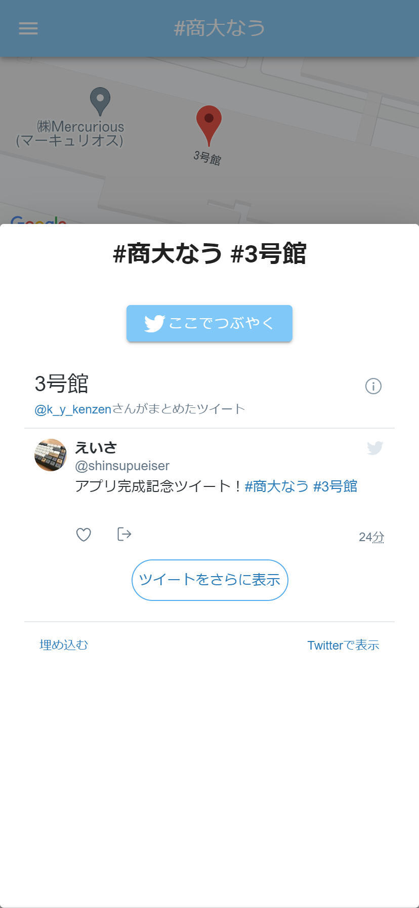
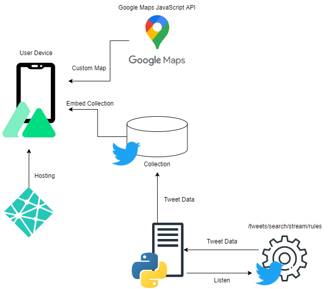

# #商大なう

  

## 概要
大学生活をより楽しむために作ったTwitter連携アプリです．

## URL
https://shodai-now.netlify.app/

## 機能
### ツイートをする
場所に対してつぶやきを残すことができます．

  

### ツイートを見る
みんながどこで何をつぶやいたのかを見ることができます．

  

## 技術構成

## License
[MIT](LICENSE)

## Authors
[Sato-Eisaku](https://github.com/Sato-Eisaku)  
[himantyu-yuma](https://github.com/himantyu-yuma)
